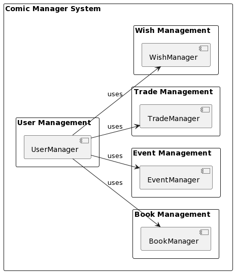
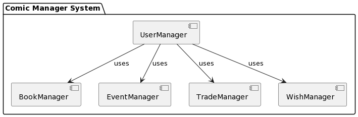
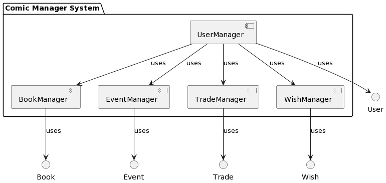

# Comic Book Manager Application

# Overview

The Comic Book Manager application is a software tool designed to assist users in cataloging and managing their comic book collections. With this application, users can easily organize their comic books, track their wishlists, manage trade lists, and stay updated on comic book events and conventions.

## Releases

- [](https://github.com/mehmetaligumusler/ce204-midterm-mehmetali-gumusler-java/releases/latest)

## Platforms

- 

- 

- 

## Test Coverage

[](https://github.com/mehmetaligumusler/ce204-midterm-mehmetali-gumusler-java/actions/workflows/release.yml)

**Coverage**

- 

**Branch Coverage**

- 

**Line Coverage**

- 

**Method Coverage**

- 

## Project Description

CE204, Midterm

## Installation

```
git clone https://github.com/mehmetaligumusler/ce204-midterm-mehmetali-gumusler-java.git
```

## Usage

### Build the Project

Enter pom.xml root folder and run following command to test and generate jar file

```bash
mvn clean test site package
```

### Run Project

You can run application by specify the Main function

```bash
java -cp comic_manager_app-1.0-SNAPSHOT.jar com.mehmetali.comic_manager.Main
```

## Contributing

Mehmet Ali GUMUSLER, (mehmetali_gumusler21@erdogan.edu.tr)

Gökay DERVISOĞLU, (gokay_dervisoglu21@erdogan.edu.tr)

## License

## Dependencies

- [Doxygen](https://www.doxygen.nl/)

- [Chocolatey](https://chocolatey.org/install)

- [Scoop](https://scoop.sh/)

- [Reportgenerator ](https://reportgenerator.io/)

## Features

### Testing

Tests are Underdevelopment with Real Environment

### Support

Project can be updated according issues.
Contact me if you have any questions.

### Contact

- Mehmet Ali GUMUSLER, (mehmetali_gumusler21@erdogan.edu.tr)

- Gökay DERVISOĞLU, (gokay_dervisoglu21@erdogan.edu.tr)

### Instructor:

- Ugur CORUH

### Acknowledgments

- [Microsoft](https://visualstudio.microsoft.com/tr/vs/community/)

- [Github](https://github.com/)

- [Doxygen](https://www.doxygen.nl/)

## About

## PLANTUML

- 

- [Plantuml](https://www.plantuml.com/plantuml/svg/xLdVJ-Eu4t-6loBYAVtou-7xM26qm88M7R3LjImF227JU8lldAIAdN8zZllRp_x4JIScKTEcA-t3lbJfp6V6Otj-ZErFIhDCvx7S7KkcL72Mfd_Ui8HDU1OyFFp1Pgm_JkEZcB_4N3CfZim_CNwA2yWHWJy-1c-xEuTlHg4Mu_VWxElNtvukhwuldWQdeo_zOAWpaKme0ggSfZuTUNVdtuohNEf-81AzkxDFU67F_3-D8aiAeQ4GxIr7s9T2QKjJOGyQAEbiVfucaT0YJOou-rh8bl28Iwwv5JYRNtqEdyt7rMSmIqW-ZLW16GajkOyx21B-2iv2-K4mC1EupUDddZd8ZCcSLzKAPLNUifYVpfYGx5doK5Cr1cc6aPmb3cs7N69BCmbgmdMZdNJT76vfPkFa7VARjRy9T9Xn5jqfdgdBB8qlXJ7kk_aPCFr2vd8jb3wskawCX68p3ebH2hpTDGev27mDRh1tuhx1c_bB_VZmy2JO-zzUmUmNRgUSm9uTxlZSaaxs0gO2-_y9_v_Q1825-vvlI8B9RpnJnhNkxAh859wV6qx2Oaw2OMgCU4spY91UcPHSBnPnd9f_OpWf5iBPQd52lM21FBhEMCIlFpBshQsXRyD1G4nm5691hzZiUr2MuQHA4i4QxYmLKI5nvyO9gOCfGlSDgKWFd4s-T4cl6kr9dvThPkIzHL0LTiFgLhJTktMkqKMOT3VgzOomB_MAADVVFryLYw9HIkRWaY1WIrJ6utJ6RUIjX49XEP5LwbO0eSnDfeMsLKYT5ljB7E5zr_WQpxwpCG-623NnjqrzYFiAuVYVeoCQq2xcBsOyqMs26q0NtTn-kmnd_bPICi8qqGP0ADQ_YVD2LqYr70IwMXwe3X2e2XU8JW6Dn996bLSzpuxZXP8ZKXFy888rdbX9zepz4Fk-76XqGjlSOooksrqxq1eT387xUVnkUF5xNGU3H4hRaOnFX3BcaZdQJxe2GY7naRBkPK2lilkb462I52phPDdTf1EHj4ZjlS8m8p7EU2JqSpvNupJZDQ85W1JqKcZ8fMmlLJg4gnUUZ5_0BHARR3_y0Wvc7s6Xri1_x4Dwf5res-Owxm2ZEGzCgoqUoGCEW9QFzhKXD3Rb14zVDITK6aWNjL16yyEIHWVgdX-Mbj71ADcplIATrwI8l2b5G0Az9XtAKSWIR2-Zm3ESazmmaRHn4eihd6I_J27NDZ1lQSldC-z9jqTxo35B4gn4yK5v-TBL-pJTjJjR4P3jMKgChUir67GZ9GZbkWQ5qbEYa8uTYamO1IvB9Krp9M-Q2IF3appq8Y2TsjP5BGWFZswRgN0c9YzwmA9Gyxz8_PGycUWN_vX35ebRbnWPcLQ2P2B6-kpSM9KYRc0FvSV65KAMJNohAoWurkbq6lfxRUQS6sC6TaMCE6UnyteYkoWvMB5D5BWZzCRoE51tLN0gPISTxfZUHGMEyPrK87AwBkUYg-wiP0jBWY3lE26NAUQOKsSzMvkKbDTRCUWidtTISeu-oMWPsaPgOpL8j5rt2aewxvFJWfZkhgZpXZizMuXkzDRjfLr_NIdMa2xF1KPk4picN9VTH5XRbHH5IB_pg2b0_iMEfypnfDUcE4LboqwhVUjJTSEH2xpQCnSutXqmQ8kB0_pnRu51zAw1GLlh7XWIkER4L_rDC5XecYcouIuO57UK_Z2eK11kVmSCU8jBu4OJoSBL73snmEh_xkG9ANVqhFe0Mcby-GSn4EdLQtkPvjERAp7j7O_YVSS3RzFd2gytZsjxytqCuNamQ0iFnX_YgiYbzDQGS6xc9MEb-mA97SUNxxwc2gr020LoAuTiypX0TBRmMk2MNek_Qtijf7ol1H4UY2_V0q6aNjjUfjbhqQIryLQB-n5t3bRlhpk7d_3E0Pv1lQnrJliHRWB5l_paP_GJR0t99ckKG0BtA-3zrV3BvWMm-bwFOPhVwotRBTQgntfSgTkVTa_q7TxIyLozygNQcex7rqneJb-f2NlbAxL5OM_jXrz1m2oBpYUUH7ai_mC0)

- 

- [Plantuml-Context](www.plantuml.com/plantuml/png/VP3FJiCm3CRlUGfhzxq01pH073bjY0FYOBKcive_K-8YJMZlJbqLH5ebFkRx_JxPEMJ19ADtnj6dW4H8RCy2FIVgX6CmUU1mmOGUBjWDQEaeLqUWCGRhQ0kSM1mzEBR1Kn3GOlE7m-ufUkxW1SE49ZXUiv3VmRU1QVvXhvdIGcdDBw7phjbIy36_tjRsOun3pTQiRJz_JKvDdyEsVqhOKysVmxR_nlbSqpLRsJTJ_0Ziz_VbbN07OwQynSfh6bovTOFJzTROWK8_UlS3)

- 

- [Plantuml-Container](www.plantuml.com/plantuml/png/SoWkIImgAStDuIf8JCvEJ4zLK7BEpyrCLl1Dp0FoYXI2AujBKdEL5Agv580WEhGujGWg5GiHSShFpqOLSIrBpIj15GefIan9HHKApopEW8lKSd6X6AsWgsk7QhI2bK9fSMenfZAeVGJLmHn1M1t2PGXb3gbvAS1G0W00)

- 

- [Plantuml-Component](www.plantuml.com/plantuml/png/XP6n2i8m443tVCMHlJ_W84LnT59n48VG7bfg4icbWeZ_RbBbZY2bsVBkSNcGcg89SR0tTJTDRou8Ukrjry3Mk7GBi7jIHAlXfI2Tqu4m_4RdBrbvtvTayq0NIxGFfiKI7JkwCdahLQo6gbgMgs410o7zQ_pUZCSHivwKYQOuXZsTYPxUepEHELUAC28nk4-C4R71PI9amlCQNPk-yWC0)

- 

- [Plantuml-UML-Class](https://www.plantuml.com/plantuml/png/xLVFJYCz3B_tAUOuLTiNg3vLq0BwqBA0bXQEA9tn3j5c9YZ9526q--mxYLkSFtId1uGuq5Dg__opOpkkUwGDKwQjnQ0GJEjiBkMlxwnX5QZiPP1rdydywkhR_TdvnUdzzV7o_sbsOnHlAjGLikP5ZVYfR-pKVnJeLfXfnXlZ12CFaGzHT5oMLfexAkGO1av6WcjZnJeV4XL9vyyBsPJSSDdanUwqO_0jIX1WmDhCdyzFydLtE3znUX_LFfOCKKjk1CJGSTR0azFiN8opQrR1PLklGMqX6oPQI9YvjgoNh8RZ3UE2hGNancVgm9qd0QmX0-kOu1Hl0Ap0x0tOJoP1AUIzkI3mhRtEFt0J1QnSQL3wJCdwZ0l8Vt81rymyU5UxuDhyP-bcQAJP1fpHKZeJMr0VDSuI4dJvU-0rQ_RYTU8sD9G4gKNH8nMASAq65SAeVDIrkUzWd9cm0pnYrFkaGJ-y9dQ1V45FQnBxxZh8HlBorTJLEOyAgr4UjrHaIdMF7FkQw3OnXorQwXt5TE_KjskZs2qAAK61aP78HDwe-2jD8wexSYPkGMakcvNDcf1DHULjM9rqWjPFKfMXz8a90JIlR5TrWW87YkjCLvxP5itr0pPjeZAAbM2bgMw4UOgY6cT-H2Zneg6skNF2A8ixALcaHKE7QTkGAWagRHuCCUKWLNIDX6Fncb7BaYH71uWzwOyvxxQ5sCD8-ZShbhmkhDr-EW8aPKu9MLakfNyb_9bpo02ee9ORi0Eq1qsqktiTGjgBHKgwsm6SVU2U5towWSRidZ3OBttpkv2DwM21C9tV8qUSUupfm8wOme5DhyqnnKEQnEJYNOVq0eDBZ4aJXVyE4xf_s4PhuUhcz4Uw5jA8YzOy1HNN1XJ5u4YZ8Bd6OKGhKZoLqYqftYCitdkJLZKB5aTPyUQ00Jp42D6eK51oiswVTI4Ll66DW6I3Gl4D276ueLz57EoHMRe9kPVu4QkGS_Ir2tsoNSWEzu-ellNpLVnFKtp_p_faCiF_GzFCPKp7MboOfxOWUc3FgSxE8cRULDFtX85yzq3ShsOFnisN7epjmWZYcn4FvO9CY8AqVc0KAUcFe2dRMlm5)

- 

- [Plantuml-Use-Case](www.plantuml.com/plantuml/png/TP2_JiCm48VtUufJzmxqVnTKcYv8PQ7a0Kny60l7HlPbY13lZXECfHlmz4dVfv_aEoLMaOVUWQCtHWuOhNbdr3PInpPuK1s7Y6sYY2fX2p09vOqZN3IXjnq-AQzCrhSnCVKB_0BCRqZKgPIZPp8sYz-DnJpItCda6eprHQsaUj0Qpo5y5BkMzfgNPvsAt_pdyNN49dXjfq-LU2lZ2pbYclEfVhoKR2UpzbEhl-p5iYCHxsLy7aQShrJqGUeREIVy4Ru1MbmkxwShLLfLMbVQLDfMsbNQLpfKEiA9l1vwzmC0)

- 

- [Plantuml-Sequance](//www.plantuml.com/plantuml/png/bPD1RiCW44Ntd6AKVIxGHPMGBikchW-0pCX1nSOouqgvVGD2bP46HooouJ_-6wBn9P1UQPkSq0Fv5Vg0grYUHtQmYvu9JZS_sG6KdlM8AtIFG3YTG0UugQuafVS_cKk0L6KUk_TvhuI8Pt1-ZsLly8MZ3OHv2ZsG_TM4IVJyHQnNDIgszGhEkIk5_oWQON1F6YpQop4-_MZdghvCMUrreplEP0TDRUQhCH3_HLOk5GT89UJE7yD8bLxvwiKsKBeQAcO6uTqXWMts3tH8UFXmXk7z6MpozulHkHk-BJciJi6GzLaoaYyrJIIt1wJlhhQ51S5lOaf1-csyKyiETkZSiPn3U7lddJbsNt0ss-J-0000)
